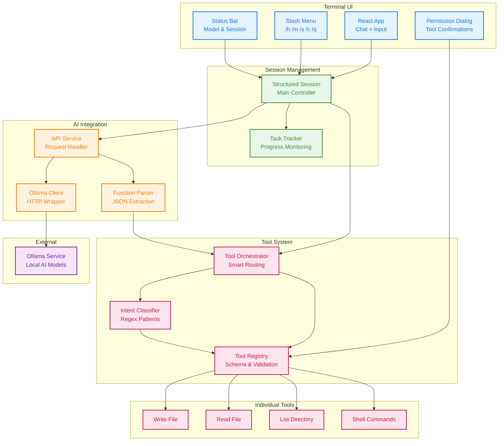

# Numidium-Local

> Your Local AI Development Agent powered by Ollama

A persistent interactive terminal application that provides Claude Code-like experience with local AI models. Built with TypeScript, React (Ink), and a structured tool calling system.

## ✨ Features

- 🚀 **Interactive Terminal UI** - Rich terminal interface with real-time chat
- 🛠️ **Structured Tool Calling** - File operations, shell commands, project analysis
- 🔄 **Smart Model Management** - Automatic fallback to available models
- 💬 **Persistent Sessions** - Conversation context and memory
- ⚡ **Local & Private** - Runs entirely on your machine via Ollama
- 🎯 **Claude Code-like Experience** - Familiar workflow for development tasks

## 🏗️ Architecture



## 🚀 Getting Started

### Prerequisites

- **Node.js** 18+
- **Ollama** installed and running
- At least one AI model downloaded

### Installation

1. **Clone the repository**
   ```bash
   git clone https://github.com/Ibzie/Numidium-Local.git
   cd Numidium-Local
   ```

2. **Install dependencies**
   ```bash
   npm install
   ```

3. **Set up Ollama** (if not already done)
   ```bash
   # Install Ollama (macOS/Linux)
   curl -fsSL https://ollama.ai/install.sh | sh

   # Pull a model (choose one)
   ollama pull llama3.2        # Recommended
   ollama pull qwen2.5         # Alternative
   ollama pull mistral         # Another option
   ```

4. **Build the project**
   ```bash
   npm run build
   ```

5. **Run Numidium-Local**
   ```bash
   npm start
   # or for development
   npm run dev
   ```

## 🔧 Ollama Management

Numidium-Local includes built-in Ollama service management:

```bash
# Start Ollama service
npm run ollama:start

# Check service status
npm run ollama:status

# List available models
npm run ollama:models

# Pull a new model
npm run ollama:pull llama3.2

# Stop Ollama service
npm run ollama:stop
```

## 💻 Usage

### Interactive Commands

Once running, use these commands in the terminal:

- **`/h`** - Show help and available commands
- **`/m`** - Switch between AI models
- **`/s`** - Configure settings
- **`/c`** - Clear conversation history
- **`/q`** - Quit application
- **`ESC`** - Quick exit

### What It Can Do

The AI can help you with:

- **File stuff** - Read, write, edit files (with your permission)
- **Shell commands** - Run terminal commands safely
- **Project exploration** - Figure out what your codebase does
- **Code generation** - Write components, functions, whatever you need
- **Debugging** - Help when things inevitably break

### Example Interactions

```
You: "Create a simple Express.js server in server.js"
🚀 I'll create an Express.js server for you...
[Creates file with proper routing and middleware]

You: "What's in the package.json file?"
📋 Let me read that for you...
[Shows package.json contents and explains dependencies]

You: "Run the test suite"
🧪 Running tests...
[Executes npm test and shows results]
```

## ⚙️ Configuration

### Model Selection

Numidium-Local automatically detects available Ollama models and falls back gracefully:

1. **Preferred Model** - Uses `qwen3:latest` by default
2. **Smart Fallback** - Switches to first available model if preferred isn't found
3. **No Models** - Shows helpful installation instructions

### Session Settings

Configure via the settings menu (`/s`):

- **Temperature** - Control response randomness
- **Context Length** - Adjust memory window
- **Tool Permissions** - Enable/disable auto-execution
- **Model Preferences** - Set default models

## 🛠️ Development

### Project Structure

```
src/
├── ui/                 # React/Ink terminal interface
├── session/           # Session and state management
├── api/              # Ollama API service layer
├── tools/            # Tool system and registry
├── ollama/           # Ollama client and utilities
├── prompts/          # System prompts and context
└── utils/            # Shared utilities

scripts/              # Ollama management scripts
```

### Building & Testing

```bash
# Development mode
npm run dev

# Build for production
npm run build

# Run tests
npm test

# Type checking
npx tsc --noEmit
```

### Adding New Tools

1. Create tool implementation in `src/tools/`
2. Define schema and validation
3. Register in `toolRegistry.ts`
4. Add permission logic

## 🤝 Contributing

We welcome contributions! Here are some areas where help is especially needed:

### 🔧 High Priority Areas

- **Tool Calling System** - Improve JSON parsing reliability and add fallback strategies
- **Error Handling** - Better user feedback when things go wrong
- **Model Support** - Test and optimize for different Ollama models
- **Performance** - Optimize response times and memory usage

### 💡 Other Contributions

- **New Tools** - Add more development tools (git operations, project analysis, etc.)
- **UI/UX** - Improve terminal interface and user experience
- **Documentation** - Examples, tutorials, and API documentation
- **Testing** - Unit tests, integration tests, and edge case handling

### 🚀 Getting Started

1. Fork the repository
2. Create your feature branch (`git checkout -b feature/amazing-feature`)
3. Commit your changes (`git commit -m 'Add amazing feature'`)
4. Push to the branch (`git push origin feature/amazing-feature`)
5. Open a Pull Request


## 🙏 Acknowledgments

- **Ollama** - For providing excellent local AI infrastructure
- **Claude Code** - For inspiration on AI development workflows
- **[Gemini CLI](https://github.com/google-gemini/gemini-cli)** - For structured function calling architecture patterns
- **Ink** - For making terminal UIs beautiful and interactive

---

**Built with Sleep Deprived weekend nights and Chai for developers who value privacy and local AI**